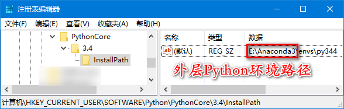

Python相关的脚本联系
======================

gather
--------

抓取教务网站的学生名单，updata成绩录入数据库，hvzs汇总数据库记录

muster.py
------------

也是抓名单的脚本...

netTime.py
---------------

同步本地时间和某个特定网站的时间

Python折腾Excel
-----------------

`中文参考 <https://blog.csdn.net/sinat_28576553/article/details/81275650#%E4%BA%8C%E3%80%81%E4%BD%BF%E7%94%A8xlwt%E6%A8%A1%E5%9D%97%E5%AF%B9%E6%96%87%E4%BB%B6%E8%BF%9B%E8%A1%8C%E5%86%99%E6%93%8D%E4%BD%9C>`_ , `英文参考 <https://www.pyxll.com/blog/tools-for-working-with-excel-and-python/>`_

Excel2003以前的格式(\*.xls)，简单的读用 *xlrd* 简单的写用 *xlwt* ，功能需求更多用 `xlwings <https://blog.csdn.net/asanscape/article/details/80372743>`_

Excel2010以后的格式(\*.xlsx), 用 *openpyxl*

**压制(suppress)关闭Excel时的保存提示**

`参考微软官方给的几个方法 <https://support.office.com/en-us/article/-how-to-suppress-save-changes-prompt-when-you-close-a-workbook-in-excel-189a257e-ec1b-40f7-9195-56d82e673071>`_ 

单一的方法都试过了,不起作用，最后实践证明下面的方法有效。在每一次变化后都要设置属性`Saved = True`，这样就可以干掉烦人的提示了！

.. code:: Visual Basic for Application

 Private Sub Worksheet_Change(ByVal Target As Range)
    ThisWorkbook.Saved = True
    ...
 End Sub

`Import Json to excel and export excel to Json <https://codingislove.com/excel-json/>`_ 

需要分析数据或数据量大可以用 *pandas*

Tips
,,,,,,,

**实用的消息框函数**

.. code:: python

 def Mbox(title, text, style = ''):
    import win32con
    from win32api import MessageBox
    if style == 'error':  # 错误
        MessageBox(0, text, title, win32con.MB_ICONERROR)
    elif style == 'info': # 信息
        MessageBox(0, text, title, win32con.MB_ICONASTERISK)
    elif style == 'warn': # 警告
        MessageBox(0, text, title, win32con.MB_ICONWARNING)
    else:
        MessageBox(0, text, title, win32con.MB_OK)
        
**Win32风格文件保存/打开对话框**

`函数定义 <http://timgolden.me.uk/pywin32-docs/win32ui__CreateFileDialog_meth.html>`_ ,
`代码示例 <https://www.programcreek.com/python/example/92919/win32ui.CreateFileDialog>`_

**精简版Anaconda--Miniconda使用笔记**

Anaconda集成了太多的东西，功能强大，唯一不爽的就是太过臃肿，每次重装系统之后都要删除重装，一堆麻烦！所以改用精简版的 `Miniconda <https://docs.conda.io/en/latest/miniconda.html>`_ ，仅包含了python环境和conda管理器prompt。

安装完后，补充一些自用的包：

  pip install spyder  !不需要先折腾PyQt
  
  pip install --ignore-installed jupyter !强制覆盖安装
  
  pip install spyder-notebook !集成jupyter到spyder环境
  
  pip install  xlwings !支持Excel和WPS专业版（个人版WPS不支持API）
  
  pip install python-docx  !仅支持2010(*.docx)格式
  
**清华Anaconda镜像** `网址 <https://mirror.tuna.tsinghua.edu.cn/help/anaconda/>`_  

遇到了一个sqlite3动态链接库无法加载的错误，参考 `StackOverflow <https://stackoverflow.com/questions/54876404/unable-to-import-sqlite3-using-anaconda-python>`_ 的方法，无需下载，在Anaconda安装路径中搜索一个sqlite3.dll文件，复制到Anaconda安装目录下的DLLs目录中，问题解决。

**Anaconda下多Python版本的玩法**

使用以下命令创建新环境：	
conda create -n env_name [list of packages]

其中 -n 代表 name，env_name 环境名称，[list of packages] 可选参数，在新环境中需要安装的工具包。

例如：安装一个名为xpy3的3.4.4版32位python环境： `参考 <https://github.com/conda/conda/issues/1744>`_ 

 *set CONDA_FORCE_32BIT=1*
 
 *conda create -n xpy3 python=3.4.4*

*3.4.4是支持win xp系统的最后一个Python3版本*，安装对应的 `pywin32 <https://github.com/mhammond/pywin32>`_ 时，pip返回找不到对应的包的错误, 手动下载对应的安装包 `pywin32-221.win32-py3.4.exe <https://github.com/mhammond/pywin32/releases/download/b221/pywin32-221.win32-py3.4.exe>`_ ，运行时遇到找不到对应的python环境的错误，此时需要手动修改系统注册表：`HKEY_CURRENT_USER\\SOFTWARE\\Python\\PythonCore`项下添加*项3.4-InstallPath*, 参数变量设置为环境安装路径即可，如下图所示。

scipy和numpy也有类似的问题，xpy344_x86安装包地址: `scipy-1.2.2-cp34-cp34m-win32.whl <https://pypi.doubanio.com/packages/43/62/09d2b135ef7794aad6e837da5a18df9aceaa1ec2062e8a399e710f555739/scipy-1.2.2-cp34-cp34m-win32.whl#md5=780ce592f99ade01a9b0883ac767f798>`_ , `numpy-1.15.4-cp34-none-win32.whl <https://pypi.doubanio.com/packages/e6/10/798bd58c97068aad4cb24e9ba60dcc7ce2e8aac7a871ea493708039a8100/numpy-1.15.4-cp34-none-win32.whl#md5=c1e1f381de7abc96509d4c5463903755>`_ 
`pywin32 <https://download.lfd.uci.edu/pythonlibs/s2jqpv5t/cp34/pywin32-224-cp34-cp34m-win32.whl>`_ 可以用pypiwin32==219替代，`参考 <https://github.com/cherrypy/cherrypy/issues/1700>`_ 

`其它版本 <https://pypi.doubanio.com/simple/numpy/>`_ 

其它相关命令（`参考1 <https://blog.csdn.net/weixin_39278265/article/details/82982937>`_ ， `参考2 <https://www.cnblogs.com/ruhai/p/10847220.html>`_ ）：

  安装环境遇到PackagesNotFoundError错误：
  
  *conda config --show-sources*  //查看源
  
  *conda config --set restore_free_channel true*  //重置免费源
  
  装完之后进入环境：*conda activate xpy3*
  
  退出：*conda deactivate*
  
  删除不需要的环境：*conda env remove -n env_name*
  
  显示所有环境：*conda env list*
  
  回溯版本：*conda list --revisions*
           
           *conda install --rev revnum*

**使用pyinstaller打包程序注意事项**

`Pyinstaller 打包发布经验总结 <https://blog.csdn.net/weixin_42052836/article/details/82315118>`_ 

`python 版的守护进程和Windows服务 <http://blog.orleven.com/2016/10/22/python-linux-daemon-windows-service/>`_ 

`Pyinstaller打包用spec添加资源文件 <https://www.yuanrenxue.com/tricks/pyinstaller-spec.html>`_

**SQLite3查询结果返回字典格式** `参考 <https://blog.csdn.net/zhengxiaoyao0716/article/details/50278069>`_ 
`参考 <https://cloud.tencent.com/developer/section/1367013>`_ , `参考 <https://dormousehole.readthedocs.io/en/latest/patterns/sqlite3.html>`_ 

**Falcon** `参考 <https://www.osgeo.cn/falcon/api/request_and_response.html>`_ 

**前缀序列**

.. code:: python

 # 最简单
 sum(['a{0},b{0}'.format(i).split(',') for i in range(1, 20)],[])
 # or
 from itertools import chain
 list(chain(*['a{0},b{0}'.format(i).split(',') for i in range(1, 20)]))
 list(chain.from_iterable(['a{0},b{0}'.format(i).split(',') for i in range(1, 20)]))
 # or
 import numpy as np
 np.ravel(['a{0},b{0}'.format(i).split(',') for i in range(1, 20)]).tolist()
 
 # 自定义函数
 def flaten(nested_list):
    for item in nested_list:
        if isinstance(item, (list, tuple)):
            for sub_item in flaten(item):
                yield sub_item
        else:
            yield item

 list(flaten([[1,2,3], [5, 2, 8], [7,8,9]]))

**中文正则表达是匹配**

很多很多的答案是 **\[\\u4e00-\\u9fa5]** ,但是在Emeditor里这个不好使，它不仅仅匹配中文。

找了一个仅仅匹配中文的正则式子 **\[\一-\龥]** 好用！！！

**错误追踪**

输出sys.exc_info()列表, [错误类型,错误值,traceback对象]
traceback对象可以用traceback.print_tb()输出查看

.. code:: python

 from traceback import print_tb
 try:
   ...
 except:
   print("Unexpected error:", sys.exc_info()[0:2])
   print_tb(sys.exc_info()[-1])

