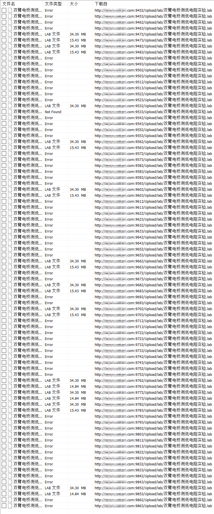

## 脱机实验包使用说明

在 **大物实验仿真** 环境安装好的基础上, 
首先双击运行 **实验项目查询** 程序, 会在程序运行目录下生成 `lablist.xml` 文件。
将 `lablist.xml` 文件拖到 **脱机仿真实验** 程序上打开, 
能够看到所有可供下载的实验项目, 点击需要下载的实验名称, 
会在 **大物实验仿真** 环境Download目录中下载对应的实验项目数据包。

直接运行 **脱机仿真实验** 可以作为脱机服务器练习使用。

### Nuitka折腾笔记

**部分常用参数说明**

> --plugin-enable=upx 启用upx压缩;
> 
> --follow-imports 在嵌入环境中等于把site-packages打包进exe文件
> 
> --nofollow-imports 对应的就是不打包任何依赖包进exe, 编译速度快, 也可以减少问题
>
> --windows-onefile-tempdir-spec=%TEMP%\someDir 配合--onefile的单一文件模式使用,指定零时解压路径
> 
> --full-compat 适配嵌入式的python包
> 
> --file-reference-choice=runtime 需要读取程序运行路径下的文件时适用
> 
> --include-package=requests 等于单独把把site-packages中的requests打包进exe文件, 可以解决系列报错 requests - urllib3 - six - No module named http.client

**编译模块** `nuitka --mingw64 --module --nofollow-imports --show-progress --full-compat --plugin-enable=upx --output-dir=o falRes.py`

全包: `nuitka --mingw64 --follow-imports --full-compat --include-package=requests --plugin-enable=upx --windows-icon-from-ico=Artua.ico --output-dir=out pySvr.py`

全不包, 无回显黑窗: `nuitka --mingw64 --nofollow-imports --full-compat --plugin-enable=upx --windows-disable-console --windows-icon-from-ico=Artua.ico --output-dir=out pySvr.py`

### pyinstaller笔记

**用例**: `pyinstaller --onefile --clean -i Artua.ico pySvr.py`

### 感谢 @[SeaHOH](https://github.com/SeaHOH)
#[228](https://github.com/SeaHOH/GotoX/discussions/228)
使用winsystray实现摆脱之前使用网页必须调用浏览器的限制

### 使用批量下载测试端口

